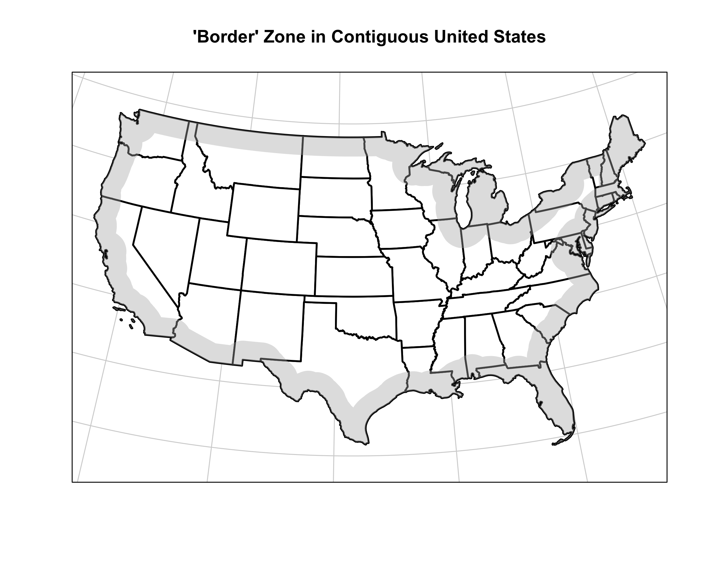
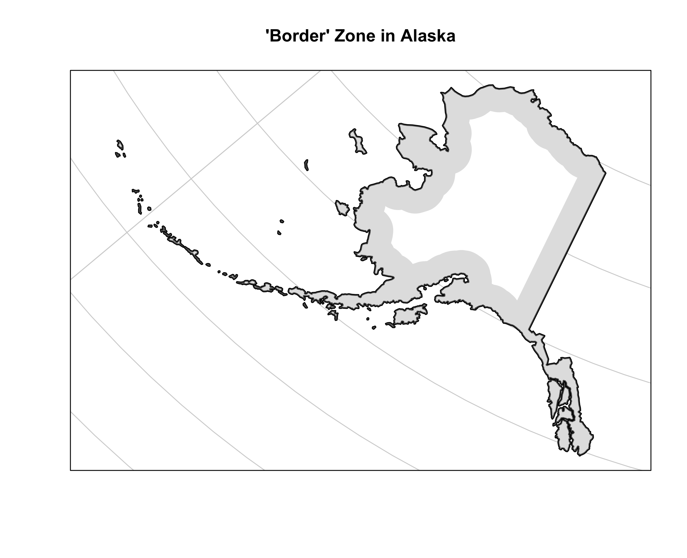
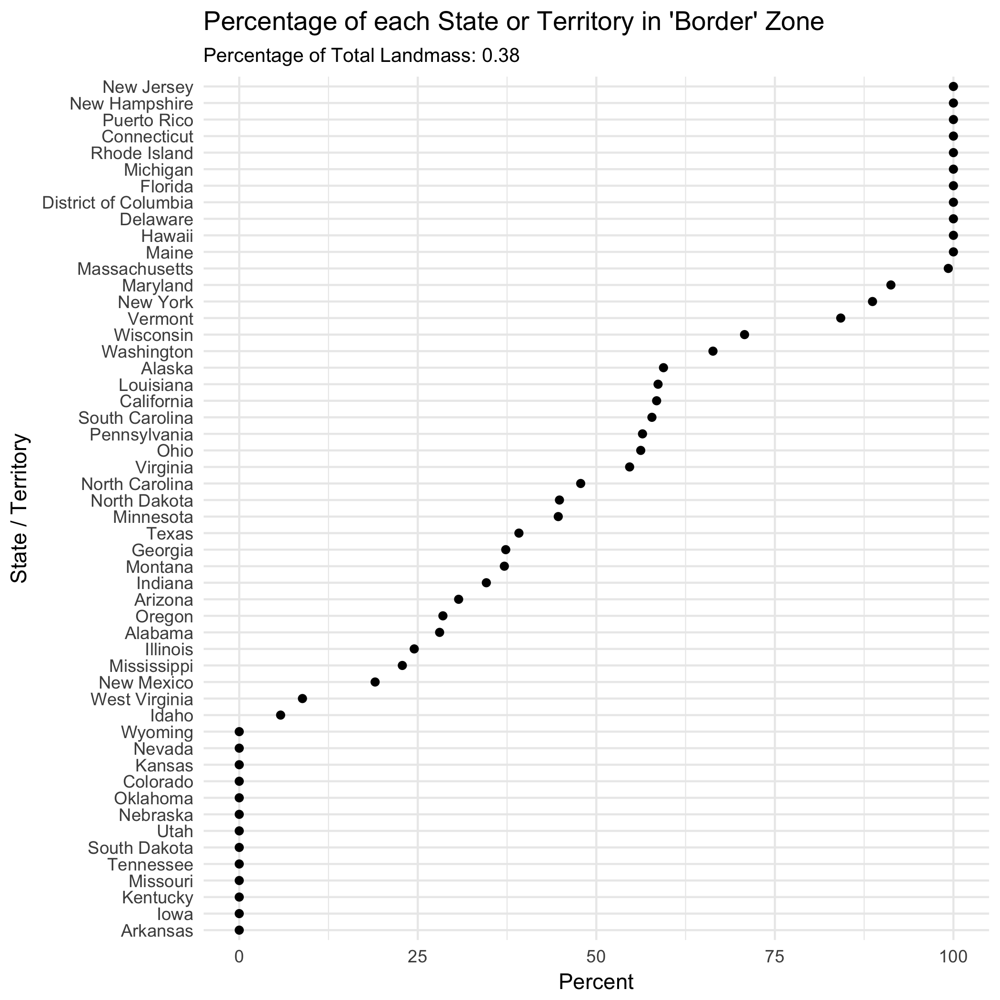
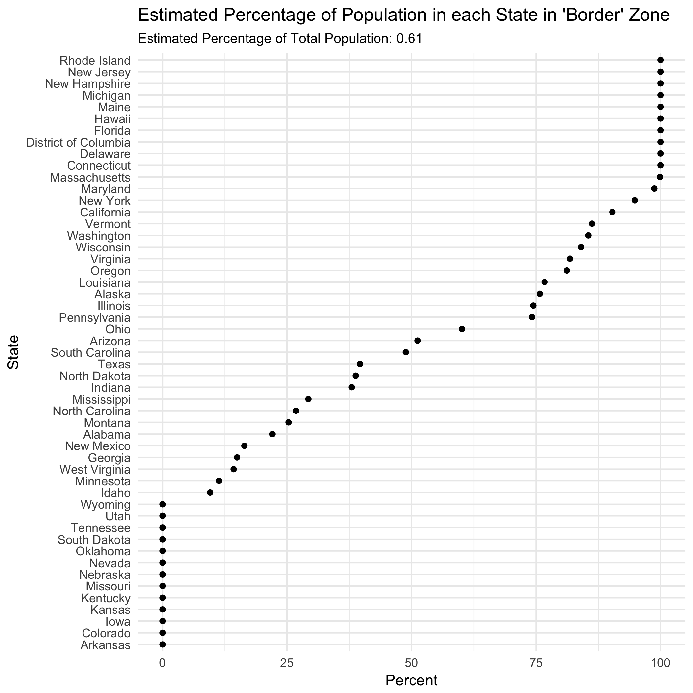
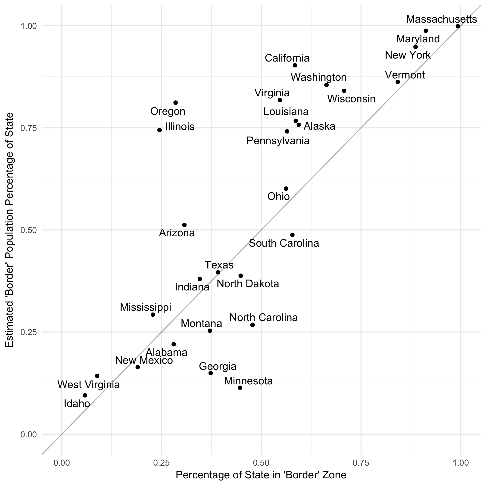
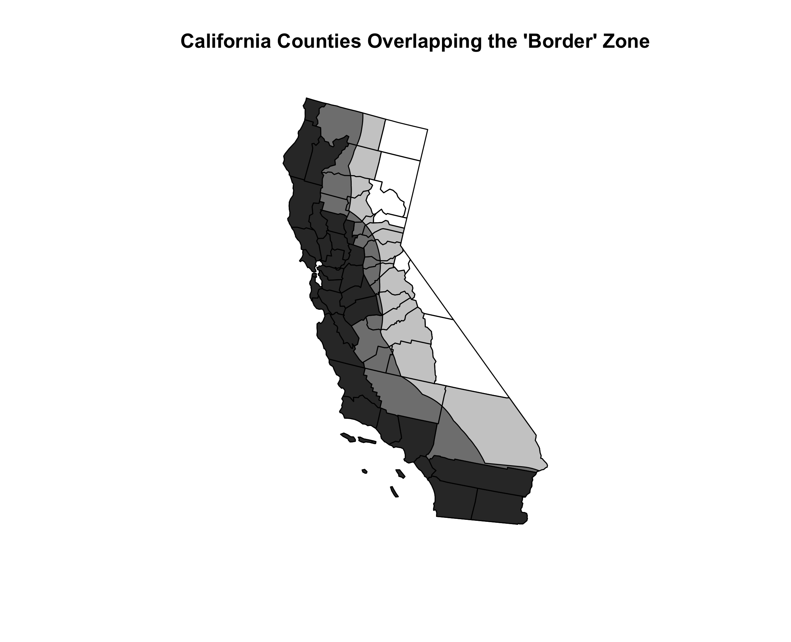
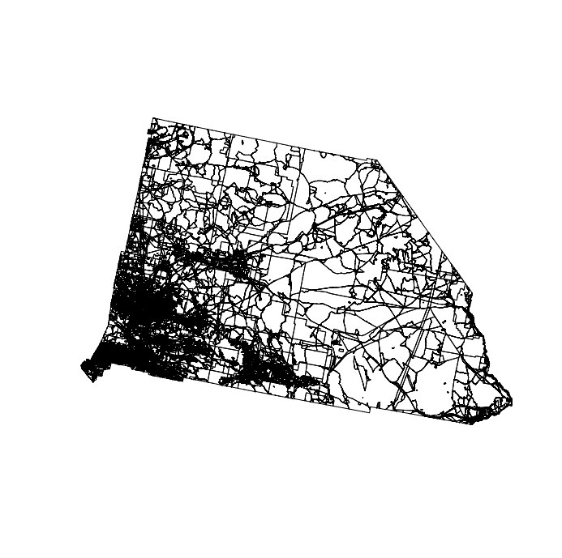
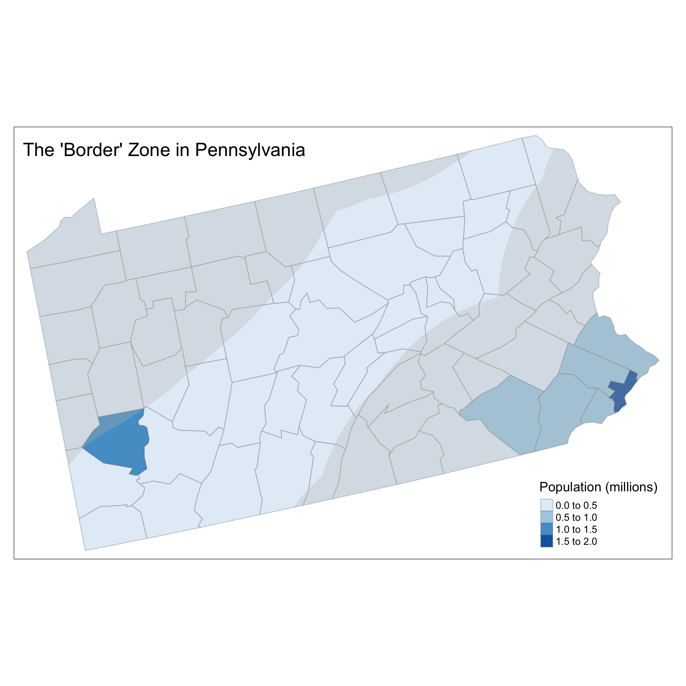
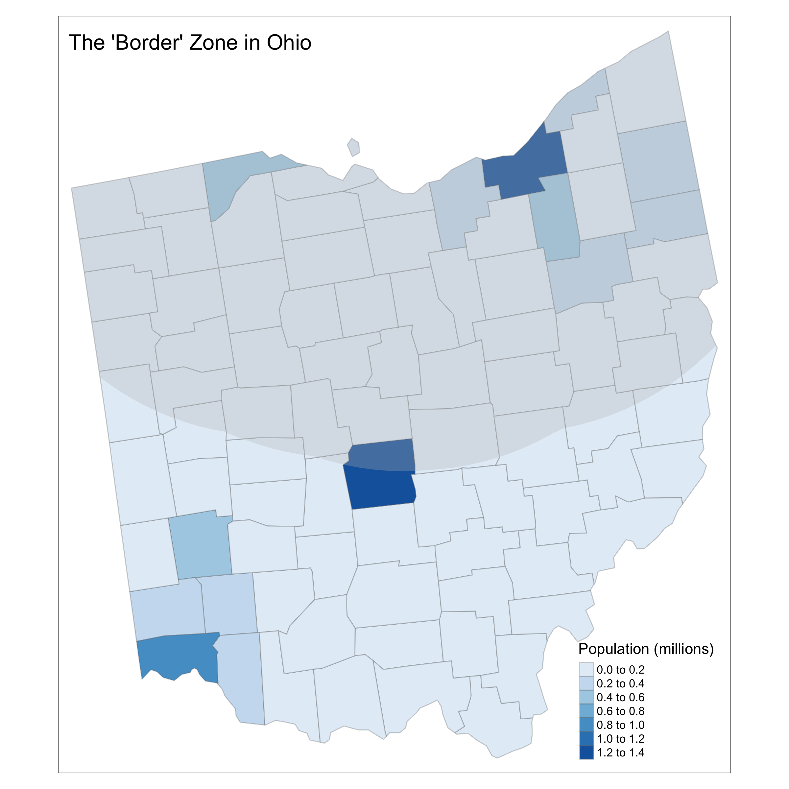

# cbp-border-zone

A short exploration of that 100 mile 'border' zone that the US Customs and Border
Patrol get to ask you for your papers in.  

Where is the 100 mile 'border' zone anyway?

Hawaii and Puerto Rico, you're definitely all in it, so I'm not going to plot
you. Sorry.

More generally, how much of each US state or territory is 'in the zone'?

But that's just space.  So here are the same proportions for 
with state populations (crudely estimated from county level data).

On the Twitter version of this graph I forgot to add in Puerto Rico, so the 
total percentage is a tiny bit higher now.  Sorry Puerto Rico!

It's a bit hard to compare these graphs, so here's another way to look at these
two sets of proportions together:

Over the diagonal states have more
people than space covered by the zone. Under the diagonal, it's the opposite.

The population estimates used here are crude estimates.  You should expect them
to be underestimates of the true numbers affected. To see why this is true,
consider the big populous counties in California overlapping the 'border' zone

Take San Bernardino County as an example.

From this census block data it's clear that most of the
population is going to be in the south west - basically in Los Angeles.

Sure enough, 25% of the county but maybe 90% of its people are in the 
'border' zone - around 1.5M more people than the simple 
interpolation would suggest.  So, while quick to compute, the original 
numbers are on average too small.

More color you say? Well, ok. Here are two states up close with county
populations and 'border' zone marked.

If you want to check my figures or ask more interesting 
questions than I did, the R that generated the first two maps is 
in [border-maps.R](border-maps.R).  The R that generated the proportions
is in [border-states.R](border-states.R).  And the code that did the California
comparisons is in [measurement-error.R](measurement-error.R). If you want to
see other states besides Ohio and Pennsylvania, you'll want the function
in [state-plots.R](state-plots.R).

So have at it - the license just says you shouldn't forget where you found 
the code. 

Will Lowe. February 19, 2018

