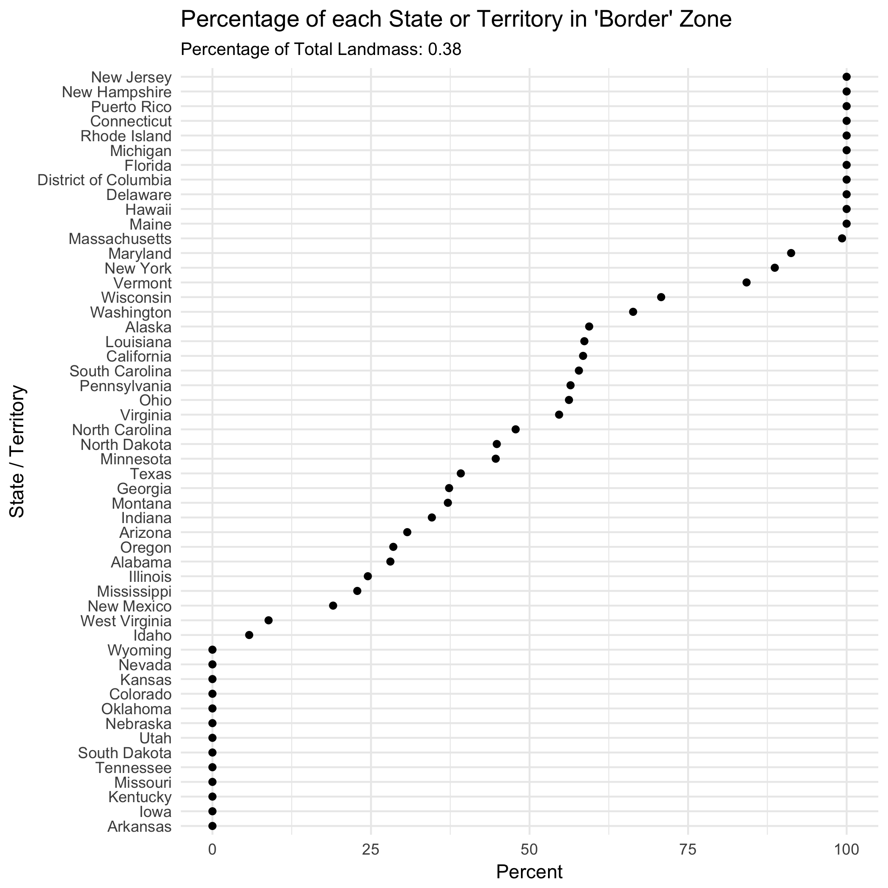

# cbp-border-zone

A short exploration of the the 100 mile 'border' in the US.

Where is US Customs and Border Patrol's 100 mile 'border' zone?

How much of your US state or territory is in the 'border' zone?

The R that generated these plots is in [cbp.R](cbp.R) with some commentary 
in [cbp.html](cbp.html).  Bot were generated from the Rmarkdown in 
[cbp.Rmd](cbp.Rmd).

Will Lowe. February 11, 2018

