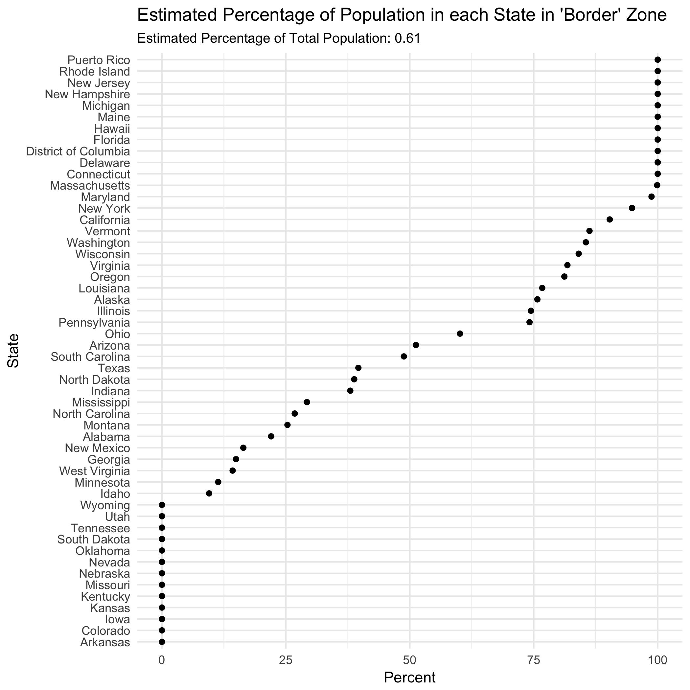

# cbp-border-zone

A short exploration of that 100 mile 'border' zone that the US Customs and Border
Patrol get to ask you for your papers in.

Where is the 100 mile 'border' zone anyway?

(Hawaii and Puerto Rico, you're definitely all in it)

So, how much of each US state or territory is 'in the zone'?

But that's just space.  So here are the same proportions for 
with state populations (crudely estimated from county level data).

It's a bit hard to compare these, so here's another way to look at these
two sets of proportions.  Over the diagonal states have more
people than space covered by the zone. Under the diagonal, it's the opposite.

In case you want to check the figures, the R that generated the maps is 
in [border-maps.R](border-maps.R), and the R that generated the proportions
is in [border-states.R](border-states.R).

Will Lowe. February 12, 2018

